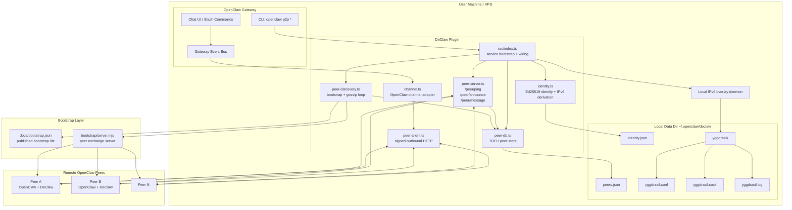
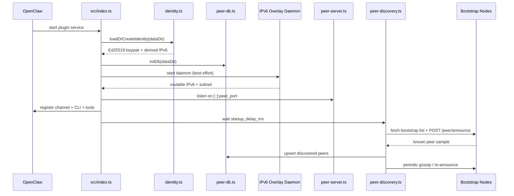
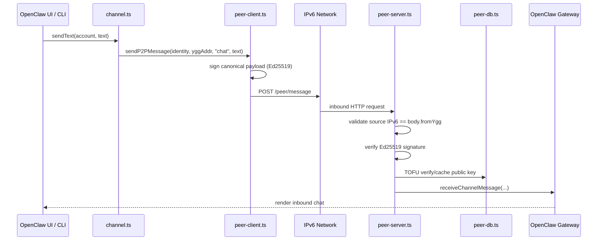

<p align="center">
  <a href="https://github.com/ReScienceLab/declaw/releases"></a>
  <a href="https://www.npmjs.com/package/@resciencelab/declaw"></a>
  <a href="https://discord.gg/JhSjBmZrqw"></a>
  <a href="LICENSE"></a>
  <a href="https://x.com/Yilin0x"></a>
</p>

Direct encrypted P2P communication between [OpenClaw](https://github.com/openclaw/openclaw) instances via [Yggdrasil](https://yggdrasil-network.github.io/) IPv6.

**No servers. No middlemen. Every message goes directly from one OpenClaw to another.**

## How it works

Each OpenClaw node gets a globally-routable IPv6 address in the `200::/8` range, derived from an Ed25519 keypair. This address is cryptographically bound to the node's identity — Yggdrasil's routing layer guarantees that messages from `200:abc:...` were sent by the holder of the corresponding private key.

Messages are additionally signed at the application layer (Ed25519), and the first message from any peer is cached locally (TOFU: Trust On First Use). Subsequent messages from that peer must use the same key.

```
Node A (200:aaa:...)   ←——— Yggdrasil P2P ———→   Node B (200:bbb:...)
  OpenClaw + plugin                                  OpenClaw + plugin
```

## Prerequisites

- [OpenClaw](https://github.com/openclaw/openclaw) installed
- [Yggdrasil](https://yggdrasil-network.github.io/installation.html) installed and on PATH
  - macOS: `brew install yggdrasil`
  - Linux: see [official instructions](https://yggdrasil-network.github.io/installation.html)

## Install

```bash
openclaw plugins install @resciencelab/declaw
```

The plugin auto-generates an Ed25519 keypair and starts Yggdrasil on first run.

## Usage

```bash
# See your Yggdrasil address (share this with peers)
openclaw p2p status

# Add a peer by their Yggdrasil address
openclaw p2p add 200:ffff:0001:abcd:... --alias "Alice"

# Check if a peer is reachable
openclaw p2p ping 200:ffff:0001:abcd:...

# Send a direct message
openclaw p2p send 200:ffff:0001:abcd:... "Hello from the decentralized world!"

# List known peers
openclaw p2p peers

# Check inbox
openclaw p2p inbox
```

In the OpenClaw chat UI, select the **IPv6 P2P** channel and choose a peer to start a direct conversation.

Slash commands:
- `/p2p-status` — show node status
- `/p2p-peers` — list known peers

## Configuration

```json
{
  "plugins": {
    "entries": {
      "declaw": {
        "enabled": true,
        "config": {
          "peer_port": 8099,
          "data_dir": "~/.openclaw/declaw",
          "yggdrasil_peers": [],
          "bootstrap_peers": [],
          "discovery_interval_ms": 600000,
          "startup_delay_ms": 30000
        }
      }
    }
  }
}
```

## Architecture

### System Overview



### Startup Flow



### Message Delivery Path



### Runtime Components

- `src/index.ts`: owns plugin lifecycle, starts local services, registers the OpenClaw channel, CLI commands, slash commands, and LLM-callable tools.
- `identity.ts`: creates the Ed25519 identity, derives stable IPv6 addresses, and signs/verifies canonical payloads.
- `peer-server.ts`: inbound HTTP surface for ping, peer exchange, and direct message delivery.
- `peer-client.ts`: outbound signed HTTP client for direct peer communication.
- `peer-discovery.ts`: bootstraps from public bootstrap nodes, merges peer tables, and runs periodic gossip.
- `peer-db.ts`: persists known peers, caches first-seen public keys, and enforces TOFU on later messages.
- `bootstrap/server.mjs`: standalone bootstrap node for peer exchange and network seeding.

### Local Files

```text
~/.openclaw/declaw/
├── identity.json              Ed25519 keypair + derived IPv6 addresses
├── peers.json                 Known peers + TOFU public key cache
└── yggdrasil/
    ├── yggdrasil.conf         Local daemon config
    ├── yggdrasil.sock         Admin socket
    └── yggdrasil.log          Daemon logs
```

The peer server listens on `[::]:8099` by default, so it can accept direct IPv6 traffic from other peers.

### Trust model

1. **Network layer**: TCP source IP must be in `200::/8` (Yggdrasil-authenticated)
2. **Body check**: `from_ygg` in request body must match TCP source IP
3. **Signature**: Ed25519 signature verified against sender's public key
4. **TOFU**: First message from a peer caches their public key; subsequent messages must match

## License

MIT
